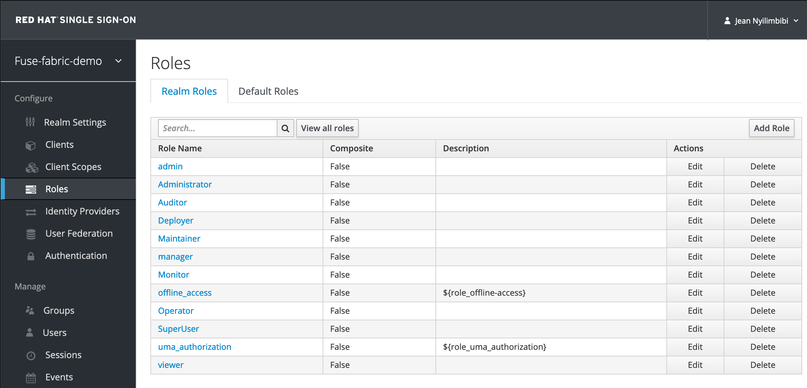
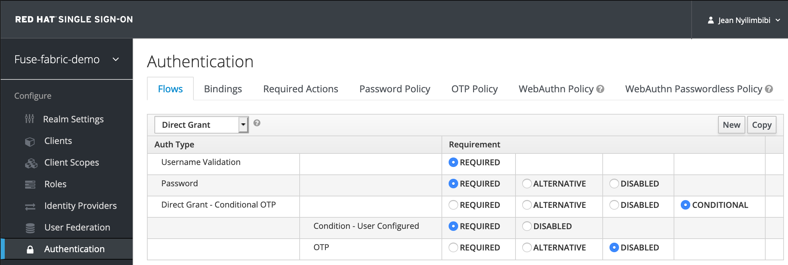
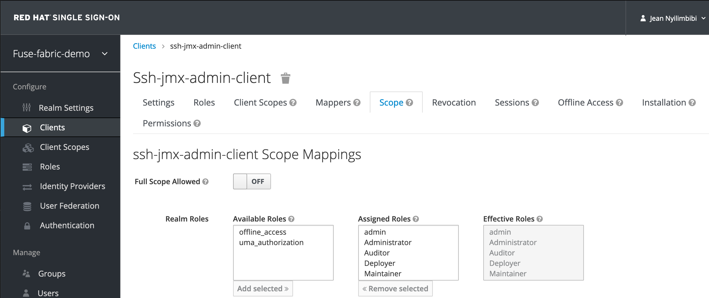

# Secure a _Fuse Fabric_ environment with _Red Hat SSO 7_

## Assumptions and pre-requisites

- _Red Hat JBoss Fuse 6.3.0 Rollup 9_ has been used in this setup to create a _fuse fabric_ environment managed by a single _fabric server_

- It is assumed at least _Red Hat SSO 7.3.8_ (upstream _keycloak_ version: _4.8.20.Final-redhat-00001_) is leveraged to secure the _Fuse Fabric_ environment

- It is assumed the _Fuse Fabric_ environment containers have the following caracteristics as far as their `jetty` servers are concerned:
  - The _fabric servers_ `jetty` is secured with `TLS` (`HTTPS`)
  - The `jetty` servers of other _fabric containers_ and _managed containers_ are not secured with `TLS` (`HTTP`)

- The _Red Hat SSO 7.3+ Client Adapter for fuse_ maven artifacts are available either via _Nexus_ or _Artifactory_ or other accessible maven repository integrated with _Fuse 6.3 Fabric_ environment. For instance, the _Red Hat SSO **7.3.8** Client Adapter for fuse_ can be downloaded via this [link](https://access.redhat.com/jbossnetwork/restricted/softwareDetail.html?softwareId=81921&product=core.service.rhsso&version=7.3&downloadType=securityPatches).

- Reference documentation: [_JBoss Fuse 6 Adapter_ for _Red Hat SSO 7.3_](https://access.redhat.com/documentation/en-us/red_hat_single_sign-on/7.3/html/securing_applications_and_services_guide/openid_connect_3#fuse_adapter)

- The following `realm roles` have to be added to the _Red Hat SSO_ [_OpenID Connect_](https://openid.net/connect/) realm securing the _Fuse Fabric_ environment (e.g. `fuse-fabric-demo`): 
  ```
  admin
  manager
  viewer
  Monitor
  Operator
  Maintainer
  Deployer
  Auditor
  Administrator
  SuperUser
  ```

  

- :warning: **NOTE for _SSH_ and _JMX_ interfaces secured with _Red Hat SSO_**:
  - The _Red Hat SSO 7.3+ Client Adapter for fuse_ uses leverages the _Resource Owner Password Credentials_ (_Direct Grant_) authentication flow
  - The _Direct Grant_ authentication flow has a number of limitations. As far as _JBoss Fuse 6.3 Fabric_ environment is concerned, the main ones are:
    - No support for identity brokering or social login, thus the users have to be stored or imported in the _Red Hat SSO 7_ database
    - Flows are not supported (user self-registration, required actions, etc.). Thus, if _OTP_ is set on users, make sure it is disabled on the `Direct Grant` Authentication Flow to allow access on _SSH_ and _JMX_ endpoints secured with _Red Hat SSO_
    

## Used variables

- `<console_vip>`: VIP fqdn for the _fabric ensemble hawtio_ consoles
- `<console_vip_port>`: VIP listening port for the _fabric ensemble hawtio_ consoles
- `<fabric_server_name>`: name of the _fabric server container_
- `<fabric_container_name>`: name of the _fabric managed container_
- `<ssh-jmx-admin-client_secret>`: _Red Hat SSO_ `ssh-jmx-admin-client` secret. This client secures the _Fuse_ administration services (_SSH_ and _JMX_ interfaces). For example, `ab91126a-e4eb-4156-9f02-aa8a1fd710b9`
- `<path_to_keystores>`: absolute path to the keystores folder. For instance, For example, `/Users/jnyilimb/workdata/opt/fuse-karaf/jboss-fuse-6_3/fabric/security`

## Create Red Hat SSO _clients_ for the secured _Fuse Fabric_ environment interfaces

### `hawtio-client` to secure the _Fabric Hawtio console_

Create the `hawtio-client` client in a _Red Hat SSO 7.3+_ realm (e.g. `fuse-fabric-demo`) with the following attributes:

- `Client ID`: `hawtio-client`
- `Access type` must be `public`
- `Redirect URI` must point to _Fuse Fabric_ environment _Hawtio_. For instance: `https://localhost:8443/hawtio/*` or `https://<console_vip>:<console_vip_port>/hawtio/*`
  - You must also have a corresponding _Web Origin_ configured. In this case, `https://localhost:8443` or `https://<vip_host>:<vip_port>`
- `Full Scope Allowed` selected to `OFF` and restrict realm roles to the following. Note that the user needs to have the proper role to successfully authenticate to _Hawtio_:
  ```
  admin
  manager
  viewer
  Monitor
  Operator
  Maintainer
  Deployer
  Auditor
  Administrator
  SuperUser
  ```
  

### `ssh-jmx-admin-client` to secure the _Fuse_ administration services

Create the `ssh-jmx-admin-client` client in a _Red Hat SSO 7.3+_ realm (e.g. `fuse-fabric-demo`) with the following attributes:

- `Client ID`: `ssh-jmx-admin-client`
- `Access type` must be `confidential`
- `Direct Access Grants Enabled` selected to `ON`
- `Redirect URI` field is mandatory but not used in this case. You can provide a dummy URL. For instance: `https://dummy/*`
- `Full Scope Allowed` selected to `OFF` and restrict realm roles to the following. Note that the user needs to have `admin` role to perform all operations or another role to perform a subset of operations (for example, the `viewer` role that restricts the user to run only read-only _Karaf_ commands):
  ```
  admin
  manager
  viewer
  Monitor
  Operator
  Maintainer
  Deployer
  Auditor
  Administrator
  SuperUser
  ```
  

## Create customized _fabric profiles_ to secure the _Fuse Fabric_ environment

### `rh-sso-hawtio` _fabric profile_ to secure the _Fabric Hawtio console_

1. Create the `rh-sso-hawtio` _fabric profile_ with the following instructions:
    ```zsh
    fabric:profile-create --parent default rh-sso-hawtio 
    fabric:profile-edit --system hawtio.realm=keycloak rh-sso-hawtio
    fabric:profile-edit --system hawtio.rolePrincipalClasses=org.keycloak.adapters.jaas.RolePrincipal,org.apache.karaf.jaas.boot.principal.RolePrincipal rh-sso-hawtio
    fabric:profile-edit --system hawtio.keycloakEnabled=true rh-sso-hawtio 
    fabric:profile-edit --system hawtio.keycloakClientConfig=profile:keycloak-hawtio-client.json rh-sso-hawtio
    fabric:profile-edit --pid org.keycloak/jaasBearerKeycloakConfigFile=profile:keycloak-hawtio.json rh-sso-hawtio
    fabric:profile-edit --repository mvn:org.keycloak/keycloak-osgi-features/4.8.20.Final-redhat-00001/xml/features rh-sso-hawtio
    fabric:profile-edit --feature keycloak rh-sso-hawtio
    ```
 
2. Add the `keycloak-hawtio-client.json` and `keycloak-hawtio.json` files as _resources_ to the `rh-sso-hawtio` _fabric profile_  (either via the _Fabric Hawtio console_ or via the `git` command usage). The contents of these files should be similar to the following (adapt the property values according to your environment):
    -	`keycloak-hawtio-client.json` - this file is used by _Red Hat SSO 7.3 Client Adapter for fuse_ on the client (_Hawtio JavaScript application_) side.
        ```json
        {
          "realm": "fuse-fabric-demo",
          "auth-server-url": "https://sso.apps.cluster-9425.sandbox1120.opentlc.com/auth",
          "ssl-required": "all",
          "resource": "hawtio-client",
          "public-client": true,
          "confidential-port": 0,
          "truststore" : "<path_to_keystores>/fuse_ts.jks",
          "truststore-password" : "P@ssw0rd"
        }
        ```
    -	`keycloak-hawtio.json` - this file is used by the _Red Hat SSO 7.3+ Client Adapter for fuse_ on the server (JAAS Login module) side.
        ```json
        {
          "realm" : "fuse-fabric-demo",
          "resource" : "jaas",
          "bearer-only" : true,
          "auth-server-url" : "https://sso.apps.cluster-9425.sandbox1120.opentlc.com/auth",
          "ssl-required" : "all",
          "use-resource-role-mappings": false,
          "principal-attribute": "preferred_username",
          "allow-any-hostname" : false,
          "truststore" : "<path_to_keystores>/fuse_ts.jks",
          "truststore-password" : "P@ssw0rd"
        }
        ```
3. Displaying the `rh-sso-hawtio` _fabric profile_ content should be similar to the following:
    ```zsh
    JBossFuse:admin@fabric-server> fabric:profile-display -r rh-sso-hawtio
    Profile id: rh-sso-hawtio
    Version   : 1.1
    Attributes:
      parents: default
    Containers: fabric-server

    Container settings
    ----------------------------
    Repositories :
      mvn:org.keycloak/keycloak-osgi-features/4.8.20.Final-redhat-00001/xml/features

    Features :
      keycloak

    System Properties :
        hawtio.realm = keycloak
        hawtio.rolePrincipalClasses = 	org.keycloak.adapters.jaas.RolePrincipal,
        org.apache.karaf.jaas.boot.principal.RolePrincipal
        hawtio.keycloakEnabled = true
        hawtio.keycloakClientConfig = profile:keycloak-hawtio-client.json

    Configuration details
    ----------------------------
    PID: org.keycloak
      jaasBearerKeycloakConfigFile profile:keycloak-hawtio.json

    Other resources
    ----------------------------
    Resource: keycloak-hawtio.json
    {
      "realm" : "fuse-fabric-demo",
      "resource" : "jaas",
      "bearer-only" : true,
      "auth-server-url" : "https://sso.apps.cluster-9425.sandbox1120.opentlc.com/auth",
      "ssl-required" : "none",
      "use-resource-role-mappings": false,
      "principal-attribute": "preferred_username",
      "allow-any-hostname" : false,
      "truststore" : "/Users/jnyilimb/workdata/opt/fuse-karaf/jboss-fuse-6_3/fabric/security/fuse_ts.jks",
      "truststore-password" : "P@ssw0rd"
    }

    Resource: keycloak-hawtio-client.json
    {
      "realm": "fuse-fabric-demo",
      "auth-server-url": "https://sso.apps.cluster-9425.sandbox1120.opentlc.com/auth",
      "ssl-required": "none",
      "resource": "hawtio-client",
      "public-client": true,
      "confidential-port": 0,
      "truststore" : "/Users/jnyilimb/workdata/opt/fuse-karaf/jboss-fuse-6_3/fabric/security/fuse_ts.jks",
      "truststore-password" : "P@ssw0rd"
    }
    ```

4. Deploy the custom `rh-sso-hawtio` _fabric profile_ to all the _fuse fabric servers_. For each _fabric server_, run the following command line:
    ```zsh
    fabric:container-add-profile <fabric_server_name> rh-sso-hawtio
    ```

### :construction: - _WIP_ - `rh-sso-administration` _profile_ to secure the _Fuse_ administration services (_SSH_ and _JMX_ interfaces)

1. Create the `rh-sso-administration` _fabric profile_ with the following instructions:
    ```zsh
    fabric:profile-create --parent default rh-sso-administration
    fabric:profile-edit --pid io.fabric8.jolokia/realm=keycloak rh-sso-administration 
    fabric:profile-edit --pid org.keycloak/jaasDirectAccessKeycloakConfigFile=profile:keycloak-direct-access.json rh-sso-administration
    fabric:profile-edit --repository mvn:org.keycloak/keycloak-osgi-features/4.8.20.Final-redhat-00001/xml/features rh-sso-administration
    fabric:profile-edit --feature keycloak-jaas rh-sso-administration
    ```

2. Add the `keycloak-direct-access.json` file as _resource_ to the `rh-sso-administration` _fabric profile_  (either via the _Fabric Hawtio console_ or via the `git` command usage). The content of this file should be similar to the following (adapt the property values according to your environment):
    -	`keycloak-direct-access.json` - this file specifies the client application configuration, which is used by _JAAS DirectAccessGrantsLoginModule_ from the _keycloak_ _JAAS_ realm for _SSH_ and _JMX_ authentication
      ```json
      {
        "realm": "fuse-fabric-demo",
        "auth-server-url": "https://sso.apps.cluster-9425.sandbox1120.opentlc.com/auth",
        "ssl-required": "all",
        "resource": "ssh-jmx-admin-client",
        "credentials": {
          "secret": "<ssh-jmx-admin-client_secret>"
        },
        "confidential-port": 0,
        "truststore" : "<path_to_keystores>/fuse_ts.jks",
        "truststore-password" : "P@ssw0rd"
      }
      ```

3. Displaying the `rh-sso-administration` _fabric profile_ content should be similar to the following:
    ```zsh
    JBossFuse:admin@fabric-server> fabric:profile-display -r rh-sso-administration
    Profile id: rh-sso-administration
    Version   : 1.1
    Attributes:
      parents: default
    Containers:

    Container settings
    ----------------------------
    Repositories :
      mvn:org.keycloak/keycloak-osgi-features/4.8.20.Final-redhat-00001/xml/features

    Features :
      keycloak-jaas

    Configuration details
    ----------------------------
    PID: org.keycloak
      jaasDirectAccessKeycloakConfigFile profile:keycloak-direct-access.json

    PID: io.fabric8.jolokia
      realm keycloak

    Other resources
    ----------------------------
    Resource: keycloak-direct-access.json
    {
      "realm": "fuse-fabric-demo",
      "auth-server-url": "https://sso.apps.cluster-9425.sandbox1120.opentlc.com/auth",
      "ssl-required": "all",
      "resource": "ssh-jmx-admin-client",
      "credentials": {
        "secret": "a2f91f8c-87e7-482b-806e-40227c28233a"
      },
      "confidential-port": 0,
      "truststore" : "/Users/jnyilimb/workdata/opt/fuse-karaf/jboss-fuse-6_3/fabric/security/fuse_ts.jks",
      "truststore-password" : "P@ssw0rd"
    }
    ```

4. Deploy the custom `rh-sso-administration` _fabric profile_ to all the _fuse fabric_ environment containers (_fabric servers_ or _fabric containers_/_managed containers_). 
    1. Start with the _managed containers_. For each _managed container_:
        1. Add the `rh-sso-administration` _fabric profile_
            ```zsh
            fabric:container-add-profile <fabric_container_name> rh-sso-administration
            ```

        2. Run the following command lines in order to make the _SSH_ and _JMX_ realms use _keycloak_ as identity provider. 
            ```zsh
            fabric:container-connect <fabric_container_name> 'config:propset -p org.apache.karaf.management jmxRealm keycloak'
            fabric:container-connect <fabric_container_name> 'config:propset -p org.apache.karaf.shell sshRealm keycloak'
            ```

        3. The container will take into account the new _PID_ keys values automatically.

    2. Repeat the same steps as above for each _fabric server_.

#### :construction: - *_TODO_* - check if encountered errors persist when the _Fuse 6.3 Fabric_ environment is secured with the latest patch of _Red Hat SSO **7.3**_. Here, _Red Hat SSO **7.4.2**_ server was used :

- :warning: Both the _Red Hat SSO **7.3.8** Client Adapter for fuse_ (`org.keycloak/keycloak-osgi-features/4.8.20.Final-redhat-00001/xml/features` repository) and _Red Hat SSO **7.4.2** Client Adapter for fuse_ (`org.keycloak/keycloak-osgi-features/9.0.5.redhat-00001/xml/features` repository) were tested.

- Secured application (_fabric container_) log sample:
  ```log
  2020-10-22 09:09:52,173 | INFO  | qtp429915276-409 | KeycloakDeployment               | 286 - org.jboss.logging.jboss-logging - 3.4.1.Final-redhat-00001 | Loaded URLs from https://sso.apps.cluster-9425.sandbox1120.opentlc.com/auth/realms/fuse-fabric-demo/.well-known/openid-configuration
  [...]
  2020-10-22 09:12:39,170 | WARN  | qtp429915276-409 | DirectAccessGrantsLoginModule    | 286 - org.jboss.logging.jboss-logging - 3.4.1.Final-redhat-00001 | Login failed. Invalid status: 500, OAuth2 error. Error: unknown_error, Error description: null
  ```

- _Red Hat SSO **7.4.2**_ server log sample:
  ```log
  sso-2-jlshg sso 08:13:16,671 ERROR [org.keycloak.services.error.KeycloakErrorHandler] (default task-18) Uncaught server error: org.keycloak.authentication.AuthenticationFlowException
  sso-2-jlshg sso 	at org.keycloak.keycloak-services@9.0.5.redhat-00001//org.keycloak.authentication.AuthenticationProcessor.authenticateOnly(AuthenticationProcessor.java:982)
  sso-2-jlshg sso 	at org.keycloak.keycloak-services@9.0.5.redhat-00001//org.keycloak.protocol.oidc.endpoints.TokenEndpoint.resourceOwnerPasswordCredentialsGrant(TokenEndpoint.java:591)
  sso-2-jlshg sso 	at org.keycloak.keycloak-services@9.0.5.redhat-00001//org.keycloak.protocol.oidc.endpoints.TokenEndpoint.processGrantRequest(TokenEndpoint.java:190)
  sso-2-jlshg sso 	at jdk.internal.reflect.GeneratedMethodAccessor540.invoke(Unknown Source)
  sso-2-jlshg sso 	at java.base/jdk.internal.reflect.DelegatingMethodAccessorImpl.invoke(DelegatingMethodAccessorImpl.java:43)
  sso-2-jlshg sso 	at java.base/java.lang.reflect.Method.invoke(Method.java:566)
  sso-2-jlshg sso 	at org.jboss.resteasy.resteasy-jaxrs@3.11.2.Final-redhat-00002//org.jboss.resteasy.core.MethodInjectorImpl.invoke(MethodInjectorImpl.java:138)
  sso-2-jlshg sso 	at org.jboss.resteasy.resteasy-jaxrs@3.11.2.Final-redhat-00002//org.jboss.resteasy.core.ResourceMethodInvoker.internalInvokeOnTarget(ResourceMethodInvoker.java:535)
  sso-2-jlshg sso 	at org.jboss.resteasy.resteasy-jaxrs@3.11.2.Final-redhat-00002//org.jboss.resteasy.core.ResourceMethodInvoker.invokeOnTargetAfterFilter(ResourceMethodInvoker.java:424)
  sso-2-jlshg sso 	at org.jboss.resteasy.resteasy-jaxrs@3.11.2.Final-redhat-00002//org.jboss.resteasy.core.ResourceMethodInvoker.lambda$invokeOnTarget$0(ResourceMethodInvoker.java:385)
  sso-2-jlshg sso 	at org.jboss.resteasy.resteasy-jaxrs@3.11.2.Final-redhat-00002//org.jboss.resteasy.core.interception.PreMatchContainerRequestContext.filter(PreMatchContainerRequestContext.java:356)
  sso-2-jlshg sso 	at org.jboss.resteasy.resteasy-jaxrs@3.11.2.Final-redhat-00002//org.jboss.resteasy.core.ResourceMethodInvoker.invokeOnTarget(ResourceMethodInvoker.java:387)
  sso-2-jlshg sso 	at org.jboss.resteasy.resteasy-jaxrs@3.11.2.Final-redhat-00002//org.jboss.resteasy.core.ResourceMethodInvoker.invoke(ResourceMethodInvoker.java:356)
  sso-2-jlshg sso 	at org.jboss.resteasy.resteasy-jaxrs@3.11.2.Final-redhat-00002//org.jboss.resteasy.core.ResourceLocatorInvoker.invokeOnTargetObject(ResourceLocatorInvoker.java:150)
  sso-2-jlshg sso 	at org.jboss.resteasy.resteasy-jaxrs@3.11.2.Final-redhat-00002//org.jboss.resteasy.core.ResourceLocatorInvoker.invoke(ResourceLocatorInvoker.java:110)
  sso-2-jlshg sso 	at org.jboss.resteasy.resteasy-jaxrs@3.11.2.Final-redhat-00002//org.jboss.resteasy.core.ResourceLocatorInvoker.invokeOnTargetObject(ResourceLocatorInvoker.java:141)
  sso-2-jlshg sso 	at org.jboss.resteasy.resteasy-jaxrs@3.11.2.Final-redhat-00002//org.jboss.resteasy.core.ResourceLocatorInvoker.invoke(ResourceLocatorInvoker.java:104)
  sso-2-jlshg sso 	at org.jboss.resteasy.resteasy-jaxrs@3.11.2.Final-redhat-00002//org.jboss.resteasy.core.SynchronousDispatcher.invoke(SynchronousDispatcher.java:440)
  sso-2-jlshg sso 	at org.jboss.resteasy.resteasy-jaxrs@3.11.2.Final-redhat-00002//org.jboss.resteasy.core.SynchronousDispatcher.lambda$invoke$4(SynchronousDispatcher.java:229)
  sso-2-jlshg sso 	at org.jboss.resteasy.resteasy-jaxrs@3.11.2.Final-redhat-00002//org.jboss.resteasy.core.SynchronousDispatcher.lambda$preprocess$0(SynchronousDispatcher.java:135)
  sso-2-jlshg sso 	at org.jboss.resteasy.resteasy-jaxrs@3.11.2.Final-redhat-00002//org.jboss.resteasy.core.interception.PreMatchContainerRequestContext.filter(PreMatchContainerRequestContext.java:356)
  sso-2-jlshg sso 	at org.jboss.resteasy.resteasy-jaxrs@3.11.2.Final-redhat-00002//org.jboss.resteasy.core.SynchronousDispatcher.preprocess(SynchronousDispatcher.java:138)
  sso-2-jlshg sso 	at org.jboss.resteasy.resteasy-jaxrs@3.11.2.Final-redhat-00002//org.jboss.resteasy.core.SynchronousDispatcher.invoke(SynchronousDispatcher.java:215)
  sso-2-jlshg sso 	at org.jboss.resteasy.resteasy-jaxrs@3.11.2.Final-redhat-00002//org.jboss.resteasy.plugins.server.servlet.ServletContainerDispatcher.service(ServletContainerDispatcher.java:227)
  sso-2-jlshg sso 	at org.jboss.resteasy.resteasy-jaxrs@3.11.2.Final-redhat-00002//org.jboss.resteasy.plugins.server.servlet.HttpServletDispatcher.service(HttpServletDispatcher.java:56)
  sso-2-jlshg sso 	at org.jboss.resteasy.resteasy-jaxrs@3.11.2.Final-redhat-00002//org.jboss.resteasy.plugins.server.servlet.HttpServletDispatcher.service(HttpServletDispatcher.java:51)
  sso-2-jlshg sso 	at javax.servlet.api@2.0.0.Final-redhat-00001//javax.servlet.http.HttpServlet.service(HttpServlet.java:590)
  sso-2-jlshg sso 	at io.undertow.servlet@2.0.30.SP4-redhat-00001//io.undertow.servlet.handlers.ServletHandler.handleRequest(ServletHandler.java:74)
  sso-2-jlshg sso 	at io.undertow.servlet@2.0.30.SP4-redhat-00001//io.undertow.servlet.handlers.FilterHandler$FilterChainImpl.doFilter(FilterHandler.java:129)
  sso-2-jlshg sso 	at org.keycloak.keycloak-services@9.0.5.redhat-00001//org.keycloak.services.filters.KeycloakSessionServletFilter.doFilter(KeycloakSessionServletFilter.java:91)
  sso-2-jlshg sso 	at io.undertow.servlet@2.0.30.SP4-redhat-00001//io.undertow.servlet.core.ManagedFilter.doFilter(ManagedFilter.java:61)
  sso-2-jlshg sso 	at io.undertow.servlet@2.0.30.SP4-redhat-00001//io.undertow.servlet.handlers.FilterHandler$FilterChainImpl.doFilter(FilterHandler.java:131)
  sso-2-jlshg sso 	at io.undertow.servlet@2.0.30.SP4-redhat-00001//io.undertow.servlet.handlers.FilterHandler.handleRequest(FilterHandler.java:84)
  sso-2-jlshg sso 	at io.undertow.servlet@2.0.30.SP4-redhat-00001//io.undertow.servlet.handlers.security.ServletSecurityRoleHandler.handleRequest(ServletSecurityRoleHandler.java:62)
  sso-2-jlshg sso 	at io.undertow.servlet@2.0.30.SP4-redhat-00001//io.undertow.servlet.handlers.ServletChain$1.handleRequest(ServletChain.java:68)
  sso-2-jlshg sso 	at io.undertow.servlet@2.0.30.SP4-redhat-00001//io.undertow.servlet.handlers.ServletDispatchingHandler.handleRequest(ServletDispatchingHandler.java:36)
  sso-2-jlshg sso 	at org.wildfly.extension.undertow@7.3.2.GA-redhat-00002//org.wildfly.extension.undertow.security.SecurityContextAssociationHandler.handleRequest(SecurityContextAssociationHandler.java:78)
  sso-2-jlshg sso 	at io.undertow.core@2.0.30.SP4-redhat-00001//io.undertow.server.handlers.PredicateHandler.handleRequest(PredicateHandler.java:43)
  sso-2-jlshg sso 	at io.undertow.servlet@2.0.30.SP4-redhat-00001//io.undertow.servlet.handlers.RedirectDirHandler.handleRequest(RedirectDirHandler.java:68)
  sso-2-jlshg sso 	at io.undertow.servlet@2.0.30.SP4-redhat-00001//io.undertow.servlet.handlers.security.SSLInformationAssociationHandler.handleRequest(SSLInformationAssociationHandler.java:132)
  sso-2-jlshg sso 	at io.undertow.servlet@2.0.30.SP4-redhat-00001//io.undertow.servlet.handlers.security.ServletAuthenticationCallHandler.handleRequest(ServletAuthenticationCallHandler.java:57)
  sso-2-jlshg sso 	at io.undertow.core@2.0.30.SP4-redhat-00001//io.undertow.server.handlers.PredicateHandler.handleRequest(PredicateHandler.java:43)
  sso-2-jlshg sso 	at io.undertow.core@2.0.30.SP4-redhat-00001//io.undertow.security.handlers.AbstractConfidentialityHandler.handleRequest(AbstractConfidentialityHandler.java:46)
  sso-2-jlshg sso 	at io.undertow.servlet@2.0.30.SP4-redhat-00001//io.undertow.servlet.handlers.security.ServletConfidentialityConstraintHandler.handleRequest(ServletConfidentialityConstraintHandler.java:64)
  sso-2-jlshg sso 	at io.undertow.core@2.0.30.SP4-redhat-00001//io.undertow.security.handlers.AuthenticationMechanismsHandler.handleRequest(AuthenticationMechanismsHandler.java:60)
  sso-2-jlshg sso 	at io.undertow.servlet@2.0.30.SP4-redhat-00001//io.undertow.servlet.handlers.security.CachedAuthenticatedSessionHandler.handleRequest(CachedAuthenticatedSessionHandler.java:77)
  sso-2-jlshg sso 	at io.undertow.core@2.0.30.SP4-redhat-00001//io.undertow.security.handlers.NotificationReceiverHandler.handleRequest(NotificationReceiverHandler.java:50)
  sso-2-jlshg sso 	at io.undertow.core@2.0.30.SP4-redhat-00001//io.undertow.security.handlers.AbstractSecurityContextAssociationHandler.handleRequest(AbstractSecurityContextAssociationHandler.java:43)
  sso-2-jlshg sso 	at io.undertow.core@2.0.30.SP4-redhat-00001//io.undertow.server.handlers.PredicateHandler.handleRequest(PredicateHandler.java:43)
  sso-2-jlshg sso 	at org.wildfly.extension.undertow@7.3.2.GA-redhat-00002//org.wildfly.extension.undertow.security.jacc.JACCContextIdHandler.handleRequest(JACCContextIdHandler.java:61)
  sso-2-jlshg sso 	at io.undertow.core@2.0.30.SP4-redhat-00001//io.undertow.server.handlers.PredicateHandler.handleRequest(PredicateHandler.java:43)
  sso-2-jlshg sso 	at org.wildfly.extension.undertow@7.3.2.GA-redhat-00002//org.wildfly.extension.undertow.deployment.GlobalRequestControllerHandler.handleRequest(GlobalRequestControllerHandler.java:68)
  sso-2-jlshg sso 	at io.undertow.core@2.0.30.SP4-redhat-00001//io.undertow.server.handlers.PredicateHandler.handleRequest(PredicateHandler.java:43)
  sso-2-jlshg sso 	at io.undertow.servlet@2.0.30.SP4-redhat-00001//io.undertow.servlet.handlers.ServletInitialHandler.handleFirstRequest(ServletInitialHandler.java:269)
  sso-2-jlshg sso 	at io.undertow.servlet@2.0.30.SP4-redhat-00001//io.undertow.servlet.handlers.ServletInitialHandler.access$100(ServletInitialHandler.java:78)
  sso-2-jlshg sso 	at io.undertow.servlet@2.0.30.SP4-redhat-00001//io.undertow.servlet.handlers.ServletInitialHandler$2.call(ServletInitialHandler.java:133)
  sso-2-jlshg sso 	at io.undertow.servlet@2.0.30.SP4-redhat-00001//io.undertow.servlet.handlers.ServletInitialHandler$2.call(ServletInitialHandler.java:130)
  sso-2-jlshg sso 	at io.undertow.servlet@2.0.30.SP4-redhat-00001//io.undertow.servlet.core.ServletRequestContextThreadSetupAction$1.call(ServletRequestContextThreadSetupAction.java:48)
  sso-2-jlshg sso 	at io.undertow.servlet@2.0.30.SP4-redhat-00001//io.undertow.servlet.core.ContextClassLoaderSetupAction$1.call(ContextClassLoaderSetupAction.java:43)
  sso-2-jlshg sso 	at org.wildfly.extension.undertow@7.3.2.GA-redhat-00002//org.wildfly.extension.undertow.security.SecurityContextThreadSetupAction.lambda$create$0(SecurityContextThreadSetupAction.java:105)
  sso-2-jlshg sso 	at org.wildfly.extension.undertow@7.3.2.GA-redhat-00002//org.wildfly.extension.undertow.deployment.UndertowDeploymentInfoService$UndertowThreadSetupAction.lambda$create$0(UndertowDeploymentInfoService.java:1530)
  sso-2-jlshg sso 	at org.wildfly.extension.undertow@7.3.2.GA-redhat-00002//org.wildfly.extension.undertow.deployment.UndertowDeploymentInfoService$UndertowThreadSetupAction.lambda$create$0(UndertowDeploymentInfoService.java:1530)
  sso-2-jlshg sso 	at org.wildfly.extension.undertow@7.3.2.GA-redhat-00002//org.wildfly.extension.undertow.deployment.UndertowDeploymentInfoService$UndertowThreadSetupAction.lambda$create$0(UndertowDeploymentInfoService.java:1530)
  sso-2-jlshg sso 	at org.wildfly.extension.undertow@7.3.2.GA-redhat-00002//org.wildfly.extension.undertow.deployment.UndertowDeploymentInfoService$UndertowThreadSetupAction.lambda$create$0(UndertowDeploymentInfoService.java:1530)
  sso-2-jlshg sso 	at io.undertow.servlet@2.0.30.SP4-redhat-00001//io.undertow.servlet.handlers.ServletInitialHandler.dispatchRequest(ServletInitialHandler.java:249)
  sso-2-jlshg sso 	at io.undertow.servlet@2.0.30.SP4-redhat-00001//io.undertow.servlet.handlers.ServletInitialHandler.access$000(ServletInitialHandler.java:78)
  sso-2-jlshg sso 	at io.undertow.servlet@2.0.30.SP4-redhat-00001//io.undertow.servlet.handlers.ServletInitialHandler$1.handleRequest(ServletInitialHandler.java:99)
  sso-2-jlshg sso 	at io.undertow.core@2.0.30.SP4-redhat-00001//io.undertow.server.Connectors.executeRootHandler(Connectors.java:390)
  sso-2-jlshg sso 	at io.undertow.core@2.0.30.SP4-redhat-00001//io.undertow.server.HttpServerExchange$1.run(HttpServerExchange.java:830)
  sso-2-jlshg sso 	at org.jboss.threads@2.3.3.Final-redhat-00001//org.jboss.threads.ContextClassLoaderSavingRunnable.run(ContextClassLoaderSavingRunnable.java:35)
  sso-2-jlshg sso 	at org.jboss.threads@2.3.3.Final-redhat-00001//org.jboss.threads.EnhancedQueueExecutor.safeRun(EnhancedQueueExecutor.java:1982)
  sso-2-jlshg sso 	at org.jboss.threads@2.3.3.Final-redhat-00001//org.jboss.threads.EnhancedQueueExecutor$ThreadBody.doRunTask(EnhancedQueueExecutor.java:1486)
  sso-2-jlshg sso 	at org.jboss.threads@2.3.3.Final-redhat-00001//org.jboss.threads.EnhancedQueueExecutor$ThreadBody.run(EnhancedQueueExecutor.java:1377)
  sso-2-jlshg sso 	at java.base/java.lang.Thread.run(Thread.java:834)
  ```

- _Red Hat SSO **7.4.2**_ server realm sends an e-mail notification similar to the following if SMTP settings are configured:
  ```log
  A failed login attempt was detected to your account on Thu Oct 22 07:09:53 GMT 2020 from x.x.x.x.
  If this was not you, please contact an administrator.
  ```