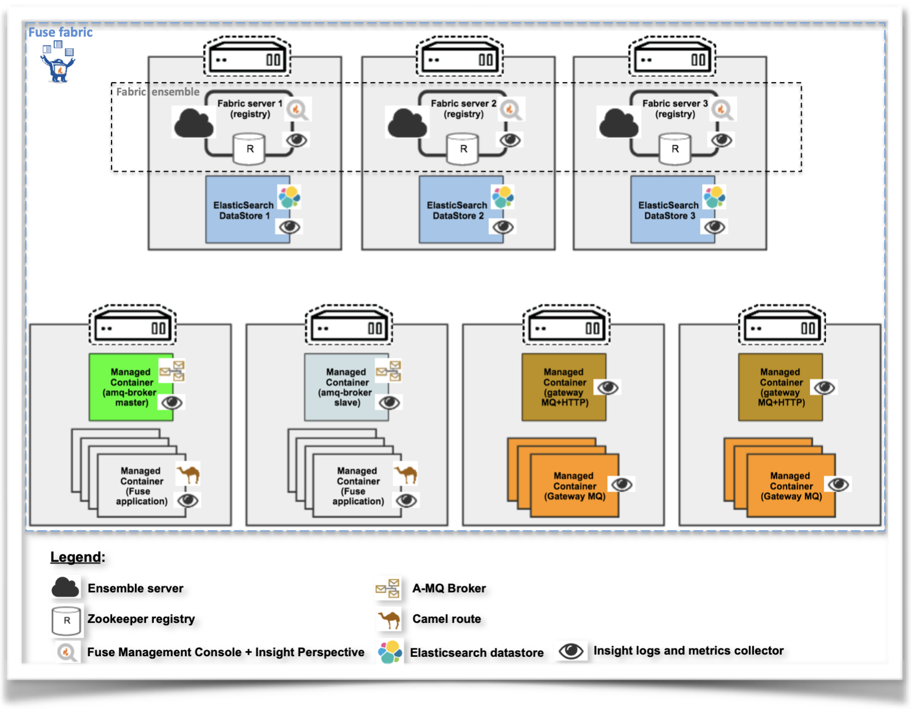

# Generate a self-signed key pair

1. Generate a self-signed keystore containing a key pair to identity to _Fuse Fabric_ environment
    ```zsh
    keytool -genkeypair -keyalg RSA -keysize 2048 -validity 3650 \
    -dname "CN=fuse-fabric,OU=Red Hat Consulting,O=Red Hat France,L=Paris,ST=Ile De France,C=FR" \
    -alias fuse-fabric \
    -keypass P@ssw0rd -storepass P@ssw0rd \
    -v -ext "san=DNS:localhost" \
    -keystore fuse-fabric-ssl.jks
    ```

2. Export the _Fuse Fabric_ public auto-signed certificate (`fuse-fabric.cert`)
    ```zsh
    keytool -export -alias fuse-fabric \
    -keystore fuse-fabric-ssl.jks \
    -storepass P@ssw0rd -v \
    -file fuse-fabric.cert
    ```

3. Create the _Fuse Fabric_ truststore (`fuse_ts.jks`) containing the _Fuse Fabric_ public certificate (`fuse-fabric.cert`)
    ```zsh
    keytool -import -alias fuse-fabric \
    -keystore fuse_ts.jks \
    -storepass P@ssw0rd -keypass P@ssw0rd \
    -v -noprompt \
    -file fuse-fabric.cert 
    ```

# Creating a _JBoss Fuse 6.3 Fabric_ on a local machine

## Used variables

- `<crypted_password>`: encrypted password using `fabric:encrypt-message` command. For example, `MkLYSntvjEMD2nSyyBkePJ9ajg+WhaBl` obtained through the following instruction:
  ```zsh
  JBossFuse:karaf@fabric-server> fabric:encrypt-message P@ssw0rd
  Encrypting message P@ssw0rd
  Using algorithm PBEWithMD5AndDES and password P@ssw0rd
  Result: MkLYSntvjEMD2nSyyBkePJ9ajg+WhaBl
  ```
  ```zsh
  JBossFuse:karaf@fabric-server> fabric:crypt-algorithm-get
  PBEWithMD5AndDES
  ``` 

- `<fuse_install_dir>`: installation home directory for _Red Hat JBoss Fuse 6.3_. For example, `/Users/jnyilimb/workdata/opt/fuse-karaf/jboss-fuse-6_3/fabric/jboss-fuse-6.3.0.redhat-495`

- `<path_to_keystores>`: absolute path to the keystores folder. For instance, For example, `/Users/jnyilimb/workdata/opt/fuse-karaf/jboss-fuse-6_3/fabric/security`

## Create a _Fabric Server_

1. Name the current _Fuse_ root server instance `fabric-server` by editing the `<install_dir>/etc/system.properties` `karaf.name` property.
    ```properties
    #
    # Name of this Karaf instance.
    #
    karaf.name = fabric-server
    ```

2. Declare the _Fuse Fabric_ truststore (`fuse_ts.jks`), containing the _Fuse Fabric_ public certificate (`fuse-fabric.cert`), on the _Fuse_ root server:
    ```zsh
    # export EXTRA_JAVA_OPTS # Additional JVM options
    export EXTRA_JAVA_OPTS='-Djavax.net.ssl.trustStorePassword=P@ssw0rd -Djavax.net.ssl.trustStore=<path_to_keystores>/fuse_ts.jks'
    ```

3. Start the _fuse_ server in foreground
    ```zsh
    <fuse_install_dir>/bin/fuse
    ```

4. Create a secure (`TLS`-enabled) _Fuse Fabric_ environment with only one _fabric server_ (_fabric ensemble_ of only 1 server):
    ```zsh
    fabric:create --clean --new-user admin --new-user-password admin123 \
    --new-user-role admin,manager,viewer,Monitor,Operator,Maintainer,Deployer,Auditor,Administrator,SuperUser \
    --zookeeper-password P@ssw0rd --resolver manualip --global-resolver manualip \
    --manual-ip 127.0.0.1 --profile fabric \
    --verbose --wait-for-provisioning
    ```

## Create customized _fabric profiles_

### Customized `ssl` _fabric profile_ to enable `SSL/TLS` on the `jetty` server 

Run the following command lines:

```zsh
fabric:profile-create --parent default ssl
fabric:profile-edit --pid org.ops4j.pax.web/org.osgi.service.http.enabled=false ssl
fabric:profile-edit --pid org.ops4j.pax.web/org.osgi.service.http.secure.enabled=true ssl
fabric:profile-edit --pid org.ops4j.pax.web/org.osgi.service.http.port.secure=\${port:8443,8543} ssl
fabric:profile-edit --pid org.ops4j.pax.web/org.ops4j.pax.web.ssl.keystore=<path_to_keystores>/fuse-fabric-ssl.jks ssl
fabric:profile-edit --pid org.ops4j.pax.web/org.ops4j.pax.web.ssl.keystore.type=jks ssl
fabric:profile-edit --pid org.ops4j.pax.web/org.ops4j.pax.web.ssl.password=\${crypt:<crypted_password>} ssl
fabric:profile-edit --pid org.ops4j.pax.web/org.ops4j.pax.web.ssl.keypassword=\${crypt:<crypted_password>} ssl
```

### Customized `gateway-http` _fabric profile_

Run the following command lines to enforce the indicated customisations:

1. Create the customized `ws-http-gateway` _fabric profile_
    ```zsh
    fabric:profile-create --parent gateway-http ws-http-gateway
    ```
    ```zsh
    fabric:profile-edit -p io.fabric8.gateway.http.mapping-apis/zooKeeperPath=/fabric/registry/clusters/apis ws-http-gateway
    ```

2. Deactivate the automatic addition of trailing forward slashes when the URL does not have one: `addMissingTrailingSlashes=false`
    ```zsh
    fabric:profile-edit -p io.fabric8.gateway.http/addMissingTrailingSlashes=false ws-http-gateway
    ```

3. Enforce explicit URI versioning by customising the URI template: `/version/{version}{contextPath}/`
    ```zsh
    fabric:profile-edit -p io.fabric8.gateway.http.mapping-apis/uriTemplate=/version/{version}{contextPath}/ ws-http-gateway
    ```

### Customized `ws-https-gateway` _fabric profile_ to secure the web services

This profile must be deployed in the same container as the customised `ws-http-gateway` (see above) for the workaround to work. Below are the reasons of this workaround:
- The `gateway-http` profile does not support `SSL`
- The `gateway-mq` supports `SSL` termination and `HTTP`. Thus, the `HTTP` and `SSL` protocols are the only activated protocols so it serves only for detecting `HTTP` after `SSL` termination. 
- The workaround works as follows:
  ```zsh
  HTTPS -gateway-mq-> HTTP -gateway-http-> discovered HTTP services
  ```

Run the following command lines:
```zsh 
fabric:profile-create --parent gateway-mq ws-https-gateway
fabric:profile-edit -p io.fabric8.gateway.detecting/mqttEnabled=false ws-https-gateway
fabric:profile-edit -p io.fabric8.gateway.detecting/openWireEnabled=false ws-https-gateway
fabric:profile-edit -p io.fabric8.gateway.detecting/stompEnabled=false ws-https-gateway
fabric:profile-edit -p io.fabric8.gateway.detecting/amqpEnabled=false ws-https-gateway
fabric:profile-edit -p io.fabric8.gateway.detecting/httpEnabled=true ws-https-gateway
fabric:profile-edit -p io.fabric8.gateway.detecting/port=9095 ws-https-gateway
fabric:profile-edit -p io.fabric8.gateway.detecting/sslEnabled=true ws-https-gateway
fabric:profile-edit -p io.fabric8.gateway.detecting/keyStoreURL=file://<path_to_keystores>/fuse-fabric-ssl.jks ws-https-gateway
fabric:profile-edit -p io.fabric8.gateway.detecting/keyPassword=\${crypt:<crypted_password>} ws-https-gateway
fabric:profile-edit -p io.fabric8.gateway.detecting/keyStorePassword=\${crypt:<crypted_password>} ws-https-gateway
fabric:profile-edit -p io.fabric8.gateway.detecting/trustStoreURL=file://<path_to_keystores>/fuse_ts.jks ws-https-gateway
fabric:profile-edit -p io.fabric8.gateway.detecting/trustStorePassword=\${crypt:<crypted_password>} ws-https-gateway
```

## Secure the `jetty` server of the _fabric server_

1. Deploy the custom `ssl` _fabric profile_ on the _fabric-server_ container
    ```zsh
    fabric:container-add-profile fabric-server ssl
    ```

2. Exit the _fabric-server_ shell
    ```zsh
    exit
    ```

3. Start the _fabric-server_ service
    ```zsh
    <fuse_install_dir>/bin/start
    ```

4. Verify the _fabric-server_ is running
    ```zsh
    $ <fuse_install_dir>/bin/status
    Running ...
    ```

## Create _Fabric containers_ (managed containers)

### :warning: IMPORTANT
- The truststore for each root container (_fabric server_ or _fabric container_) must be set in the `<fuse_install_dir>/bin/setenv` script under the additional _JVM_ options variable (`EXTRA_JAVA_OPTS`)
- The truststore for child-containers can be set while creating them through the `--jvm-opts` of the `fabric:container-create-child` command
- The `ssl` profile should not be added to child-containers because the gateway-http is not able to discover secured (`HTTPS`) services. The child-container `jetty` server must be left with plain `HTTP`.

### Instructions

1.	Create the `ws-gateway-node` managed container for Web Services gateways
    ```zsh
    fabric:container-create-child \
    --jvm-opts='-Djavax.net.ssl.trustStore=<path_to_keystores>/fuse_ts.jks -Djavax.net.ssl.trustStorePassword=P@ssw0rd' \
    --profile ws-http-gateway \
    --profile ws-https-gateway \
    fabric-server ws-gateway-node
    ```
2.	Create the `amq-broker-node1` and `amq-broker-node2` managed containers for _JBoss AMQ 6.3_ brokers
    ```zsh
    fabric:container-create-child \
    --jvm-opts='-Djavax.net.ssl.trustStore=<path_to_keystores>/fuse_ts.jks -Djavax.net.ssl.trustStorePassword=P@ssw0rd' \
    fabric-server amq-broker-node 2
    ```

3.	Create the `fuse-apps-node1` and `fuse-apps-node2` managed containers for _Fuse 6.3_ applications
    ```zsh
    fabric:container-create-child \
    --jvm-opts='-Djavax.net.ssl.trustStore=<path_to_keystores>/fuse_ts.jks -Djavax.net.ssl.trustStorePassword=P@ssw0rd' \
    fabric-server fuse-apps-node 2
    ```

# Deploy a HA cluster (live/backup pair) of _JBoss A-MQ 6.3.0_ brokers

1.	Create the `demo-broker` profile. Replace `<path_to_datastore>` with a valid path.
    ```zsh
    fabric:mq-create \
    --data <path_to_datastore>/demo-broker \
    --group demo-broker \
    --profile demo-broker \
    --minimumInstances 2 \
    --kind MasterSlave \
    demo-broker
    ```

2. Deploy the `demo-broker` profile on the broker containers.
    ```zsh
    fabric:container-add-profile amq-broker-node1 demo-broker
    fabric:container-add-profile amq-broker-node2 demo-broker
    ```

# Example of Fuse Fabric8 topology with Insight

